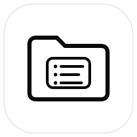
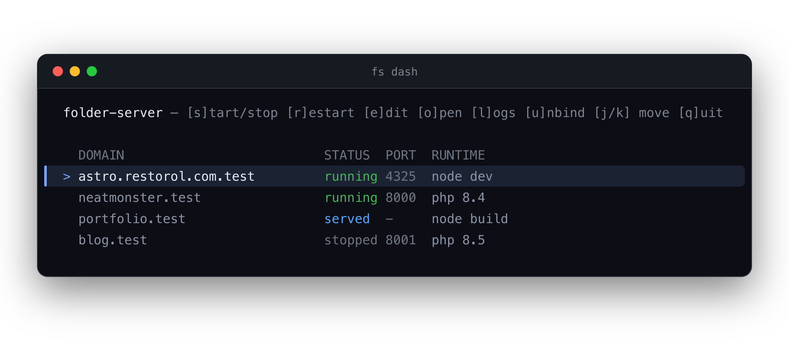

<p align="center">
  
</p>

<h1 align="center">Folder Server v1.0</h1>

<p align="center">
  <em>Serve any folder at <code>https://&lt;name&gt;.test</code> — a tiny, brew-based MAMP&nbsp;Pro replacement for Apple&nbsp;Silicon macOS.</em>
</p>

<p align="center">
  <a href="https://github.com/drewaltukhov/folder-server/actions/workflows/ci.yml"></a>
  
  
  <a href="LICENSE"></a>
</p>

<p align="center">
  
</p>

`fs` turns any folder into a local site at **`https://<name>.test`** with trusted
HTTPS, a PHP version you pick, optional MySQL, and a live terminal dashboard — all
from Homebrew packages and a handful of shell scripts. No Electron, no Intel binaries.

## ✨ Features

- 🌐 **Pretty local domains** — every folder gets `https://<name>.test` (via dnsmasq + Caddy)
- 🔒 **Trusted HTTPS** — real, browser-trusted certs per site (mkcert), no warnings
- 🐘 **Per-folder PHP** — pick `8.3` / `8.4` / `8.5` per project
- 🟢 **Node / npm projects too** — serve a dev server (Vite, Astro, Next, …) or a static build at `<name>.test`
- 🗄️ **MySQL on demand** — opt in per project; the database + user are auto-provisioned
- 📱 **Test on your phone** — opt in with `lan=on` to also serve the site over the LAN at `https://<mac>.local:<port>`
- 🔀 **`.htaccess`-style routing** — front-controller rewrites for WordPress / Laravel / etc.
- 🖥️ **Live dashboard** — start/stop, edit config, view logs, unbind — all from `fs dash`
- 🧹 **Clean lifecycle** — guided `install` / `setup` / `fix` / `uninstall` scripts

## Requirements

- **macOS on Apple Silicon** with [Homebrew](https://brew.sh)
- At least one PHP: `brew install php` (or `php@8.3` / `php@8.4` / `php@8.5`)
- MySQL only if a project uses `db=on`: `brew install mysql`

## Install

```sh
git clone https://github.com/drewaltukhov/folder-server.git
cd folder-server
./install.sh     # symlinks `fs` + `folder-server` into /opt/homebrew/bin
fs setup         # installs deps (dnsmasq, caddy, gum, fzf), sets up DNS/cert/Caddy
```

`fs setup` prints a few one-time `sudo` lines to finish (starting dnsmasq/caddy and
adding the DNS resolver) — run those once and you're set.

`install.sh` also drops in **shell completion** for `zsh` and `bash` (subcommands,
`--all`, and `db`/`autostart` actions), and `uninstall.sh` removes it again.

### Start sites at login (optional)

Caddy and dnsmasq are brew services, so they survive a reboot — but your
per-folder site servers don't. Opt into restoring them automatically:

```sh
fs autostart on      # a login agent runs `fs up --all` at every login
fs autostart status  # on / off
fs autostart off     # remove the agent
```

## Quick start

The fastest path — one command, and your browser opens on the page:

```sh
cd ~/Sites/my-project
fs serve         # zero-config: default PHP, serve, open the browser
```

Or set it up explicitly:

```sh
fs init          # a short interactive setup → writes .folderserver
fs up            # serve it
open https://my-project.test
```

`fs init` walks you through the PHP version (or a node runtime), optional
routing, and optional MySQL (with a login/password).

## Commands

| Command | What it does |
|---|---|
| `fs serve` | Zero-config: default PHP config, serve, and open the browser |
| `fs init` | Interactive setup for the current folder → writes `.folderserver` |
| `fs up` / `fs up --all` | Serve this folder (or every known site) |
| `fs down` / `fs down --all` | Stop this folder (or every site) |
| `fs restart` / `fs restart --all` | Restart this folder (or every known site) |
| `fs edit` | Change PHP / routing / MySQL for this folder |
| `fs list` | Table of all sites and their status |
| `fs dash` | Live dashboard — `[e]dit` `[u]nbind` `[l]ogs` `[o]pen` `[s]tart/stop` |
| `fs open` | Open this folder's URL in the browser |
| `fs logs` | Tail this folder's PHP log |
| `fs db start\|stop\|status` | Control the shared MySQL service |
| `fs autostart on\|off\|status` | Start every known site at login (launchd agent) |
| `fs lan on\|off\|status\|ca` | Expose this site to the local network (phones/tablets); `ca` prints the one-time trust guide |
| `fs unbind` / `fs unbind --all` | Stop, delete `.folderserver`, and forget the site (or every site) |

## Configuration — `.folderserver`

Each project has a small config file in its root:

```ini
domain=my-project.test
php=8.4
docroot=public          # optional — defaults to the folder root
rewrite=index.php        # optional — front-controller routing (below)
db=on                    # optional — provision MySQL on `fs up` (below)
db_name=my_project
db_user=app
db_pass=secret
lan=on                   # optional — also serve on the local network (below)
```

### Node / npm projects (`type=node`)

`fs init` detects a `package.json` and offers a **node** runtime (you can still
pick `php`). Two modes:

**Dev server** (`mode=dev`) — runs your dev command and proxies `<name>.test` to
it, with live reload:

```ini
type=node
command=npm run dev      # detected (supports pnpm / yarn / bun)
port=5173                # the port your dev server listens on
```

- folder-server **auto-detects the port the dev server actually binds** (from its
  startup log), so it works even when a project hardcodes a custom port in its
  config. `port=` is optional — it seeds the injected `PORT` and acts as a fallback.
- folder-server rewrites the upstream `Host` to loopback so dev servers don't
  reject the proxied hostname (`Blocked request … is not allowed`).
- `install=on` (default when `fs init` detects a node project) auto-runs the
  package manager's install step on `fs up` when `node_modules` is missing.

**Static build** (`mode=build`) — runs the build once; Caddy then serves the
output folder directly (no running process):

```ini
type=node
mode=build
build=npm run build
docroot=dist             # the build output folder to serve
rewrite=index.html       # optional — SPA client-side routing fallback
```

`fs restart` rebuilds. MySQL (`db=on`) works with node projects too.

### Front-controller routing (`rewrite`)

There's no `.htaccess` support (that's Apache-only; this serves via `php -S`).
For apps that need the classic "send unknown URLs to `index.php`" rewrite
(WordPress, Laravel, Symfony, …), set `rewrite` to your front-controller file:

```ini
rewrite=index.php
```

`fs up` then serves existing files (static assets and real `.php`) directly and
routes everything else to that file — the same behaviour `.htaccess`'s
`RewriteRule` gives you. Omit `rewrite` for plain static + direct `.php` access.

### MySQL (`db`)

Set `db=on` with a `db_user`/`db_pass` (and optional `db_name`, defaulting to the
folder name). On `fs up`, MySQL starts and the database + user are created for you,
so this just works:

```php
$pdo = new PDO('mysql:host=127.0.0.1;port=3306;dbname=my_project', 'app', 'secret');
```

`fs up` prints the exact details after provisioning:

```
  MySQL ready — connect with:
    host      127.0.0.1   (use this, not "localhost")
    port      3306
    database  my_project
    user      app
    password  secret
```

**Good to know:**
- **Use a dedicated `db_user`, not `root`** — `root` is the admin account
  folder-server connects as to provision, so it can't also be your app user.
- **Connect on `127.0.0.1`, not `localhost`** — `localhost` uses the socket (and
  MySQL's passwordless `root@localhost`); `127.0.0.1` uses TCP with your user.
- Credentials live in plaintext in `.folderserver` — don't commit it if the
  password matters.

### Test on your phone (`lan`)

Set `lan=on` (via `fs init`, `fs edit`, or `fs lan on`) and `fs up` also publishes
the site to your local network over mDNS — no DNS setup on the phone:

```
Serving ~/Sites/my-project → https://my-project.test (php 8.4, port 51843)
  ↳ network: https://users-mac.local:8443   (open on your phone …)
```

Open that `https://<mac>.local:<port>` URL on any device on the same Wi-Fi. Each
site gets its own stable port (from `8443` up), and the URL shows in `fs up`,
`fs list`, and `fs lan status`.

**One-time per device:** trusted HTTPS needs the device to trust folder-server's
local certificate authority — there's no way around this for a private cert. Run:

```sh
fs lan ca      # prints the rootCA.pem location + step-by-step trust guide
```

AirDrop `rootCA.pem` to the phone, install the profile, then **enable it under
Settings → General → About → Certificate Trust Settings** (the step everyone
forgets). After that, every `lan=on` site loads with a green padlock. `fs lan ca`
covers iPhone/iPad, Android, and another Mac.

**Good to know:**
- Only devices with the CA installed get valid HTTPS; it's a private CA, so a
  public/registered domain isn't involved.
- If a phone can't connect and the macOS firewall is on, allow incoming
  connections for `caddy` (System Settings → Network → Firewall → Options).
- Turn it off any time with `fs lan off` (or `lan=off` in `.folderserver`).

## Maintenance & troubleshooting

```sh
./fix.sh              # audit the setup and offer to repair anything broken
./fix.sh --dry-run    # report problems without changing anything
./fix.sh --yes        # fix everything without prompting
```

`fix.sh` checks brew deps, the `*.test` DNS rule + resolver, that the **mkcert CA
is installed and trusted** (the usual cause of SSL warnings), the Caddy import,
whether dnsmasq/caddy are running, `*.test` resolution, MySQL health (a
duplicate/stale `mysqld` is the usual cause of a start failing), and stale site
processes — and offers to fix each one.

## Uninstall

```sh
./uninstall.sh        # stop services + remove folder-server's system wiring
./uninstall.sh --purge # also remove the brew packages, cert, and ~/.folder-server
```

It stops the services and removes the wiring first, then **asks** before removing
any brew packages. **PHP is never removed**, and MySQL (with its databases) is only
removed if you explicitly confirm it.
